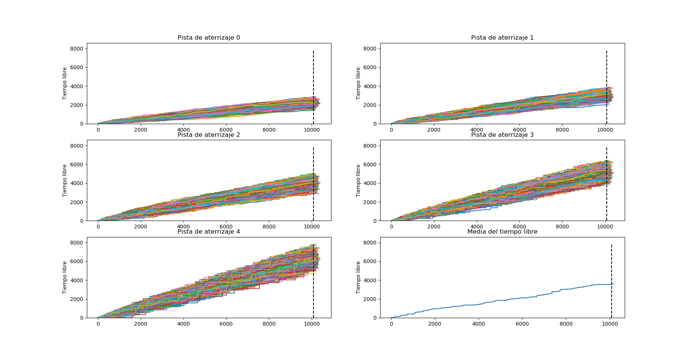
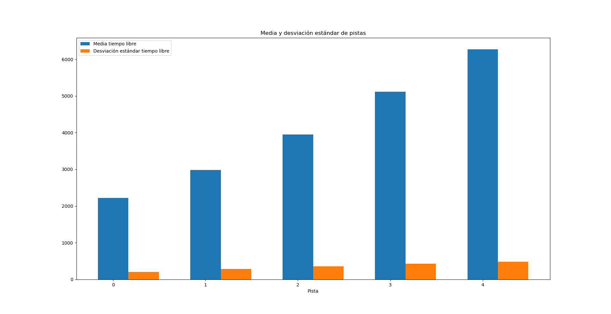

# Proyecto de Simulación

- Luis Ernesto Ibarra Vázquez C411

[Proyecto de github](https://github.com/luisoibarra/airport-simulation)

## Aeropuerto de Barajas

En el Aeropuerto de Barajas, se desea conocer cuánto tiempo se encuentran vacı́as las pistas de aterrizaje. Se conoce que el aeropuerto cuenta con un máximo de 5 pistas de aterrizaje dedicadas a aviones de carga y que se considera que una pista está ocupada cuando hay un avión aterrizando, despegando o cuando se encuentra cargando o descargando mercancı́a o el abordaje o aterrizaje de cada pasajero. Se conoce que el tiempo cada avión que arriba al aeropuerto distribuye, mediante una función de distribución exponencial con λ = 20 minutos. Si un avión arriba al aeropuerto y no existen pistas vacı́as, se mantiene esperando hasta que se vacı́e una de ellas (en caso de que existan varios aviones en esta situación, pues se establece una suerte de cola para su aterrizaje. Se conoce además que el tiempo de carga y descarga de un avión distribuye mediante una función de distribución exponencial con λ = 30 minutos. Se considera además que el tiempo de aterrizaje y despegue de un avión distribuye normal (N(10,5)) y la probabilidad de que un avión cargue y/o descargue en cada viaje corresponde a una distribución uniforme. Además de esto se conoce que los aviones tiene una probabilidad de tener una rotura de 0.1. Ası́, cuando un avión posee alguna rotura debe ser reparado en un tiempo que distribuye exponencial con λ = 15 minutos. Las roturas se identifican justo antes del despegue de cada avión. Igualmente cada avión, durante el tiempo que está en la pista debe recargar combustible y se conoce que el tiempo de recarga de combustible distribuye expoencial λ = 30 minutos y se comienza justamente cuando el avión aterriza. Se asume además que los aviones pueden aterrizar en cada pista sin ninguna preferencia o requerimiento. Simule el comportamiento del aeropuerto por una semana para estimar el tiempo total en que se encuentran vacı́a cada una de las pistas del aeropuerto.

## Ideas

Para la solución del problema se creó una paquete auxiliar `simulate`. Este nos ayuda a separar el proceso de simulación abstracto de uno ya concreto. Este paquete se centra en las siguientes ideas escenciales para su implementación:

- La simulación de eventos discretos se basa en una sucesión de eventos en un tiempo dado.
- Estos eventos tienen que estar ordenados por tiempo.
- Una vez ocurre algún evento, el sistema se tiene que modificar acorde este.
- Toda simulación empieza con un evento inicial.

Teniendo en cuenta esto se crearon diferentes estructuras que permiten la creación de simulaciones basadas en las premisas anteriores:

Primero que todo se creó una clase **Event** que simboliza un evento a ocurrir. Esta clase posee un *timestamp* que indica el momento en que ocurrió o va a ocurrir.

Para el manejo de eventos se creó la clase **EventHandler**. El manejo de eventos se realizará usando el patrón visitor al llamar con el tipo del evento el método `handle` correspondiente. Esto permite tener controlado, separado y organizado las reacciones a los diferentes eventos que pueden ser muchos. Además permite devolver de manera sencilla el estado que se quiera enseñar por cada reacción a los eventos.

Para completar se creó la clase **Simulation**. Esta clase en primer lugar contiene la infomación del tiempo actual de la simulación además un heap en el cual se van añadiendo los eventos, ordenados por el *timestamp*, y posee un **EventHandler** para la reacción a estos. Presenta una manera sencilla de correr la simulación y mostrar el estado de esta en cada paso al iterar sobre este.

## Modelo

El modelado del problema se basó en el paquete `simulate`, anteriormente explicado, y sus respectivas premisas.

Primero se detectaron los eventos a los cuales hacía falta reaccionar. Se encontraron los siguientes:

- Llegada de un avión, **AirplaneArrival**
- Avión aterrizado, **AirplaneLanded**
- Avión listo para despegar, **AirplaneDeparture**
- Avión despegado, **AirplaneDepartured**
- Terminada la carga y/o descarga del avión, **AirplaneLoadedUnloaded**
- Terminado el llenado de combustible del avión , **AirplaneFueled**
- Avión reparado, **AirplaneRepaired**

Una vez detectados los eventos se procedió a realizar el handler para estos, se creó el **AirportEventHandler** con el patrón visitor mencionado anteriormente por cada uno de los eventos detectados y en estos se escribió la lógica para manejarlos.

Finalmente se creó la clase **AirportSimulation** la cual contiene el estado de la simulación. Este estado consiste en:

- Lista de pistas (*tracks*): Guarda el estado de las pistas de aterrizaje.
- Cola de aviones (*airplane_queue*): Guarda los aviones en orden de llegada que aún no han aterrizado.
- Tiempo máximo (*max_time*): Tiempo máximo que tienen los aviones permitido llegar
- Variables aleatorias para los tiempos y probabilidades de los eventos.

### Notas de la simulación

En la simulación se consideró:

- Los eventos de carga, descarga y de llenado de combustible ocurren simultáneos.
- Un avión puede ser arreglado varias veces antes de despegar.
- Una vez se alcanza el tiempo máximo no llegan más aviones y la simulación se acaba cuando el aeropuerto se vacía

## Resultados de la simulación

En la imagen anterior se observa el tiempo libre, en función del tiempo, de las diferenetes pistas en 1000 simulaciones, con la media de estas al final. Se observa la línea discontinua que marca el final de la llegada de los aviones.

Se puede observar una tendencia lineal al aumento de tiempo libre en las pistas. En dependencia de las pistas la pendiente varía ligeramente siendo en las primeras más pequeñas y con una tendencia al aumento a medida que se aumenta el número de la pista. Tambien aumenta la varianza de la pendiente a medida que se aumenta el número de la pista. Esto se observa en la siguiente figura

Esta tendencia se podría explicar mediante el proceso de selección de la pista de aterrizaje, ya que se tiene una predisposición de elegir las primeras. Esto implica que las primeras pistas se verán más utilizadas que las últimas.

El tiempo libre promedio de las pistas se encuentra según las simulaciones es de 3572 minutos.
